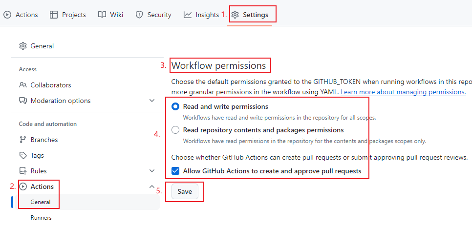

# Rublog blog, Github repository

This project is inspired by [WordPressXMLRPCTools](https://github.com/zhaoolee/WordPressXMLRPCTools), which provided me with ideas.

Since I don't like xmlrpc, I use the RestAPI of WordPress for updates.

The WordPress API library is from [wordpress-markdown-blog-loader](https://github.com/binxio/wordpress-markdown-blog-loader) with minor modifications.

[Click here to skip the blog table of contents and view the warehouse instructions.](#Write Markdown articles using Github Actions and automatically update them to WordPress)

[Click here, Warehouse Usage Instructions](#Usage Tutorial)

[中文简体](../README.md) --- [English](README_EN.md) --- [Deutsch](README_DE.md) --- [Français](README_FR.md) --- [Español](README_ES.md) --- [Русский](README_RU.md) --- [繁體中文](README_ZH-CHT.md) --- [日本語](README_JP.md)

---start---

## Contents (Updated on July 27, 2024)

[How to Use GitHub Actions to Publish Markdown Articles to a WordPress Website](https://www.rxx0.com/?p=4150) &emsp;&emsp; Publication Date: July 27, 2024 - 05:24

[Skills for debugging GitHub Actions using act](https://www.rxx0.com/software/diao-shi-github-actions-de-4-chong-gong-ju.html)  
Release time: July 27, 2024 - 04:55

[Two methods to solve the problem of "Permission denied (publickey)" when connecting to GitHub via SSH in SourceTree](https://www.rxx0.com/software/liang-chong-fang-fa-jie-jue-sourcetree-tong-guo-ssh-lian-jie-github-permission-denied-publickey-wen-ti.html)
&emsp;&emsp; Release time: July 26, 2024 - 10:58

[Test Python & Markdown to Automatically Publish Articles](https://www.rxx0.com/software/test-python-and-markdown-to-automatically-publish-articles.html) &emsp;&emsp; Publication Time: July 24, 2024 - 16:10

---End---  

## Write Markdown articles using Github Actions and automatically update them to WordPress

- The most comfortable format for writing a blog is Markdown.

- The most worry-free way to manage a blog site is WordPress.

- The best platform to promote a blog website is Github.

This project allows you to write blogs in Markdown. After pushing the updates to Github, Github Actions will automatically update the articles to WordPress and update the article URLs to README.md.


### What are the benefits of using GitHub Actions?

Github Actions allows us to run code without installing a development environment.


Just create a new Markdown article and then update it to the repository. Github Actions will automatically update the article to WordPress and update the article link to README.md.


## Usage Tutorial

### The plugins that need to be installed for WordPress

- [Rankmath](https://rankmath.com/wordpress/plugin/seo-suite) SEO plugin

### Obtain the required WordPress configuration

What requires special handling is only the WordPress login password. This login password is not the back-end password for web page login. A RestAPI application password needs to be generated separately.

Application passwords allow authentication through non-interactive systems such as XML-RPC or REST API without the need to provide your actual password. Application passwords can be revoked at any time. They cannot be used to log in to your website in the traditional way.

The generation method is as follows:


### How to protect your WordPress account password?

Github has a secrets feature that can protect critical information such as usernames and passwords. Only Github Actions can access this critical information.

This project requires setting up three secrets.

- Fill in the WordPress login username. The variable name is USERNAME.
- Fill in the WordPress RestAPI application password. The variable name is PASSWORD.
- Fill in the domain name of WordPress. The variable name is HOST.


### Allow Github Actions to write back to the repository

The security protection features of Github are becoming more and more complete, and this permission needs to be enabled separately. The opening method is as follows:



### How to create a new article?

Rename the `example` folder in the `posted` directory, copy it to the `need_post` folder, and continue to edit the `index.md` markdown file in the folder.

The "images" folder stores the referenced images, or you can directly reference online images, CDN images, or images from image hosting platforms.


### Article Management: How to classify articles and add keyword tags?

Fill in the following initialization information at the top of the `.md` file to complete the settings of the title, tags, and categories. **All the following items are mandatory**.

```tag and category
author: xinyu2ru
categories:
- software
date: 2024-07-24 08:21:00
excerpt: Write the abstract content of the article here. This text should appear in the article abstract.
image: images/banner.jpg
status: publish
title: Write the title of the article here
focus-keywords: markdown upload wordpress
```

- **author must exist**
- The classification directory of "categories" must exist.
- The banner image must exist.

## What's the difference between tags and categories?

Tags are keywords for a single article. For example, the tags for bananas are **yellow** and **sweet** (tags are the attributes of bananas).
Classification (categories) is the attribution of this article. For example, the classification of bananas is **fruit**, **plant**.

## How to use?

After completing the above configurations

Every time you add or update an article in the `need_post` folder, just run the git commands!

```git
git pull && git add _posts && git commit -m "update" && git push
```

You can also use various git management software to commit the updates to GitHub.

### The display effect of Github README.md (the newly added article is ranked first)


## How to complete the blog update operation on the mobile phone?

Hammer Notes allows you to write in Markdown in an elegant and comfortable way.

Obsidian is also the editing software I mainly use now. It can be used on both computers and mobile phones.

## 更新

- The SEO plugin was changed from Yoast to Rank Math (February 11, 2025, 11:51)
- Update this README file (March 1, 2025 09:32)
