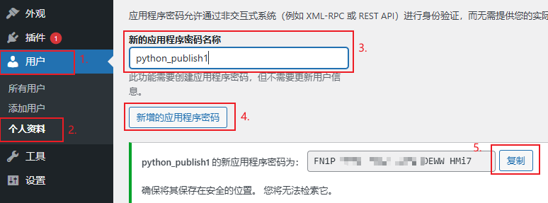
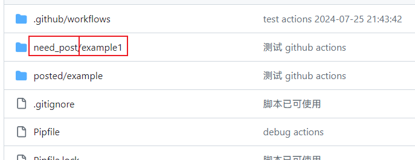

# Rublog blog Repositorio de Github 

Este proyecto se inspira en [WordPressXMLRPCTools](https://github.com/zhaoolee/WordPressXMLRPCTools), lo que me ha proporcionado ideas. 

Dado que no me gusta xmlrpc, uso la RestAPI de WordPress para actualizar.

La biblioteca de la API de WordPress proviene de [wordpress-markdown-blog-loader](https://github.com/binxio/wordpress-markdown-blog-loader), con ligeras modificaciones.

[Haz clic aquí para saltar el índice del blog y ver la descripción del almacén.](#Escribir artículos de Markdown con Github Actions y actualizarlos automáticamente en WordPress)

[Haz clic aquí, Instrucciones de uso del almacén](#Manual de uso)

[中文简体](../README.md) --- [English](README_EN.md) --- [Deutsch](README_DE.md) --- [Français](README_FR.md) --- [Español](README_ES.md) --- [Русский](README_RU.md) --- [繁體中文](README_ZH-CHT.md) --- [日本語](README_JP.md)

---start---

## Contenidos (actualizado el 27 de julio de 2024)

[Cómo usar GitHub Actions para publicar artículos de Markdown en un sitio web de WordPress](https://www.rxx0.com/?p=4150) &emsp; &emsp; Fecha de publicación: 2024-07-27 05:24 

[Técnicas para depurar GitHub Actions con act](https://www.rxx0.com/software/diao-shi-github-actions-de-4-chong-gong-ju.html)  
Fecha de publicación: 2024-07-27 04:55 

[Dos métodos para resolver el problema de "Permission denied (publickey)" al conectar GitHub a través de SSH en SourceTree](https://www.rxx0.com/software/liang-chong-fang-fa-jie-jue-sourcetree-tong-guo-ssh-lian-jie-github-permission-denied-publickey-wen-ti.html)  
&emsp; &emsp; Fecha de publicación: 2024-07-26 10:58 

[Prueba de publicación automática de artículos con Python & Markdown](https://www.rxx0.com/software/test-python-and-markdown-to-automatically-publish-articles.html) &emsp; &emsp; Fecha de publicación: 2024-07-24 16:10 

---End---  

## Escribir artículos de Markdown con Github Actions y actualizarlos automáticamente en WordPress

- El formato más cómodo para escribir blogs es Markdown;

- La forma más tranquila de administrar un blog es WordPress;

- La mejor plataforma para promocionar un blog es Github.

Este proyecto te permite escribir blogs en Markdown. Después de hacer push de las actualizaciones a Github, Github Actions actualizará automáticamente los artículos a WordPress y actualizará la URL del artículo en README.md. 


### ¿Cuáles son los beneficios de utilizar Github Actions?

Github Actions nos permite ejecutar el código sin necesidad de instalar un entorno de desarrollo.


Solo es necesario crear un nuevo artículo Markdown y luego actualizarlo en el repositorio. Github Actions actualizará automáticamente el artículo a WordPress y actualizará el enlace del artículo en README.md. 


## Manual de uso

### Los complementos (Plugins) que necesitan instalarse en WordPress

- [Rankmath](https://rankmath.com/wordpress/plugin/seo-suite) Plugin de SEO

### Obtener la configuración de WordPress necesaria

Lo que se trata de manera especial es solo la contraseña de inicio de sesión de WordPress. Esta contraseña de inicio de sesión no es la contraseña del panel de administración para el inicio de sesión en la página web. Es necesario generar de forma independiente una contraseña de aplicación RestAPI. 

Las contraseñas de aplicación permiten la autenticación a través de sistemas no interactivos (por ejemplo, XML-RPC o REST API) sin necesidad de proporcionar tu contraseña real. Las contraseñas de aplicación se pueden revocar en cualquier momento. No se pueden utilizar para iniciar sesión en tu sitio web de manera tradicional. 

El modo de generación es el siguiente:




### ¿Cómo proteger la contraseña de tu cuenta de WordPress?

Github tiene una función de secrets que puede proteger información clave como nombres de usuario y contraseñas. Solo Github Actions puede leer esta información clave. 

Para este proyecto, es necesario configurar tres secretos.

- Rellene el nombre de usuario de inicio de sesión de WordPress. El nombre de variable es USERNAME.
- Rellene la contraseña de la aplicación de WordPress RestAPI. El nombre de variable es PASSWORD.
- Escribe el nombre de dominio de WordPress. El nombre de variable es HOST.


### Permitir que Github Actions escriba de nuevo en el repositorio

Las funciones de protección de seguridad de Github son cada vez más completas y se necesita abrir este permiso por separado. El método de apertura es el siguiente:


### ¿Cómo crear un nuevo artículo?

Cambia el nombre de la carpeta `example` en el directorio `posted`, copia la carpeta modificada al directorio `need_post` y continúa editando el archivo `index.md` en formato markdown dentro de la carpeta.  

La carpeta "images" almacena las imágenes referenciadas, o se pueden hacer referencias directas a imágenes de la web, imágenes CDN o imágenes de servidores de imágenes. 



### Gestión de artículos: ¿Cómo clasificar artículos y agregar etiquetas de palabras clave?

En la parte superior del archivo `.md`, complete la siguiente información de inicialización para completar la configuración del título, etiquetas y categorías. **Todos los siguientes elementos son obligatorios**. 

```tag and category
author: xinyu2ru
categories:
- software
date: 2024-07-24 08:21:00
excerpt: Escribe aquí el resumen del artículo. Este párrafo debe aparecer en el resumen del artículo.
image: images/banner.jpg
status: publish
title: Escribe aquí el título del artículo
focus-keywords: markdown upload wordpress
```

- **author debe existir**
- Los catálogos de categorías de "categories" deben existir.
- La imagen del banner debe existir.

## ¿Cuál es la diferencia entre las etiquetas (tags) y las categorías (categories)?

Las etiquetas (tags) son palabras clave para un solo artículo. Por ejemplo, las etiquetas de plátano son **amarillo**, **dulce** (las etiquetas son atributos del plátano).  
Las categorías son la clasificación a la que pertenece este artículo. Por ejemplo, la clasificación del plátano es **fruta**, **planta**. 

## ¿Cómo se utiliza?

Después de completar la configuración anterior

Cada vez que se agregue o actualice un artículo en la carpeta `need_post`, ¡simplemente ejecute la instrucción de git!

```git
git pull && git add _posts && git commit -m "update" && git push
```

También se pueden utilizar una variedad de software de gestión de git para enviar actualizaciones a GitHub.

### Efecto de visualización del README.md de Github, (los nuevos artículos se colocan en primer lugar)


## ¿Cómo actualizar un blog con el móvil?

锤子便签 puede escribir en Markdown de manera elegante y cómoda. 

Obsidian, el software de edición que actualmente utilizo principalmente, se puede utilizar tanto en ordenadores como en teléfonos móviles. 

## Actualizar

- El complemento SEO se cambió de Yoast a Rank Math (11 de febrero de 2025, 11:51)
- Actualizar este archivo README (1 de marzo de 2025 09:32)
