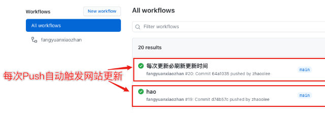
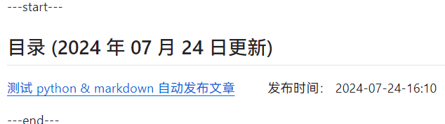
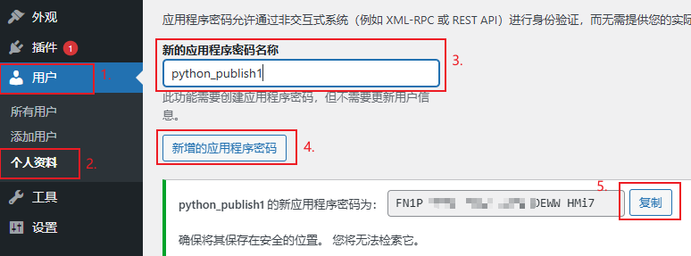
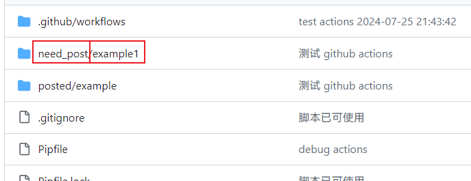

# Rublog ブログ Github リポジトリ

このプロジェクトは[WordPressXMLRPCTools](https://github.com/zhaoolee/WordPressXMLRPCTools) から参考を得ており、これが私にアイデアを提供してくれました。 

私はxmlrpcが好きではないため、WordPressのRestAPIを使って更新します 。  

WordPress API ライブラリは [wordpress-markdown-blog-loader](https://github.com/binxio/wordpress-markdown-blog-loader) から来ており、軽微な修正が加えられています 。  

[ここをクリックして、ブログ目次をスキップして倉庫説明を見る ](#Github Actionsを使ってMarkdown記事を書き、自動的にWordPressに更新する)

[ここをクリック、倉庫の使用説明](#使い方ガイド)

[中文简体](../README.md) --- [English](README_EN.md) --- [Deutsch](README_DE.md) --- [Français](README_FR.md) --- [Español](README_ES.md) --- [Русский](README_RU.md) --- [繁體中文](README_ZH-CHT.md) --- [日本語](README_JP.md)

---start---

## 目次（2024年7月27日更新）

[GitHub Actions を使って Markdown 記事を WordPress サイトに公開する方法](https://www.rxx0.com/?p=4150)  &emsp; &emsp; 公開日時：2024年7月27日 05:24  

[actを使ってGitHub Actionsをデバッグするテクニック](https://www.rxx0.com/software/diao-shi-github-actions-de-4-chong-gong-ju.html)  
公開日：2024年7月27日 04:55  

[2つの方法でSourceTreeがSSH経由でGitHubに接続する際の「Permission denied (publickey)」問題を解決する](https://www.rxx0.com/software/liang-chong-fang-fa-jie-jue-sourcetree-tong-guo-ssh-lian-jie-github-permission-denied-publickey-wen-ti.html)　　 掲載日： 2024年7月26日10:58 

[テスト python & markdown 自動記事投稿](https://www.rxx0.com/software/test-python-and-markdown-to-automatically-publish-articles.html)　　 投稿時間： 2024年7月24日 16:10 

---End---  

## Github Actionsを使ってMarkdown記事を書き、自動的にWordPressに更新する

- ブログを書くのに最も快適な形式はMarkdownです ；

- ブログサイトを管理するのに最も手軽な方法はWordPressです ；

- ブログサイトを広める最適なプラットフォームはGithubです。

このプロジェクトでは、Markdown を使ってブログを書くことができます。Github に push 更新を行った後、Github Actions が自動的に記事を WordPress に更新し、記事の URL を README.md に更新します 。  


### Github Actionsを使用する利点は何ですか？

Github Actionsは、開発環境をインストールすることなく、コードの実行を完了することができます。 



Markdown 記事を新規作成するだけで、それからリポジトリに更新すると、Github Actions が自動的に記事を WordPress に更新し、記事のリンクを README.md に更新します。 



## 使い方ガイド

### WordPressにインストールする必要があるプラグイン 

- [Rankmath](https://rankmath.com/wordpress/plugin/seo-suite) SEOプラグイン

### 必要なWordPressの設定を取得する

特殊な処理が必要なのは WordPress のログインパスワードだけです。このログインパスワードはウェブサイトにログインするためのバックエンドパスワードではなく、別途 RestAPI アプリケーションパスワードを生成する必要があります。 

_アプリケーションパスワードを使用すると、XML - RPCやREST APIなどの非対話型システムを通じて認証を行うことができ、実際のパスワードを入力する必要がありません。アプリケーションパスワードはいつでも取り消すことができます。これらは、従来の方法でサイトにログインするためには使用できません。_ 

生成方法は以下の通りです：




### WordPress アカウントのパスワードをどのように保護するか？

GitHubにはsecrets機能があり、ユーザー名やパスワードなどの重要な情報を保護することができます。重要な情報はGitHub Actionsだけが読み取ることができます 。  

このプロジェクトでは3つのシークレットを設定する必要があります 

- WordPress のログインユーザー名を入力します。変数名は USERNAME です 。
- WordPress RestAPI アプリケーションパスワードを入力し、変数名を PASSWORD とする 
- WordPressのドメインを記入します。変数名はHOSTです 。


### Github Actionsにリポジトリへの書き戻しを許可する

Githubのセキュリティ保護機能はますます充実しており、この権限を単独で開く必要があります。開放方法は以下の通りです：


### 新しい記事を作成するにはどうすればいいですか 

`posted` ディレクトリ内の `example` フォルダの名前を変更し、`need_post` ディレクトリにコピーし、続けてフォルダ内の `index.md` のMarkdownファイルを編集する。 

images フォルダには参照する画像を保存するか、直接インターネット上の画像、CDN の画像または画像共有サイトの画像を参照します。  



### 記事管理：記事をどのように分類したりキーワードタグを付けたりするか？

`.md` ファイルの先頭に以下の初期化情報を記入することで、タイトル（title）、タグ（tags）、カテゴリ（categories）の設定が完了します。**以下の内容はすべて必須項目です**。 

```tag and category
author: xinyu2ru
categories:
- software
date: 2024-07-24 08:21:00
excerpt: ここに記事の要約内容を書きます。この文章は記事の要約に表示されるはずです。
image: images/banner.jpg
status: publish
title: ここに記事のタイトルを書きます
focus-keywords: markdown upload wordpress
```

- authorは必須です
- categoriesの分類目録は必ず存在しなければなりません 
- バナー画像は必ず存在しなければなりません

## タグ（tags）とカテゴリ（categories）の違いは何ですか？

タグ（tags）は単一の記事に関するキーワードです。たとえば、バナナのタグには**黄色**、**甘味** （タグはバナナの属性です）があります 。  
分類（categories）はこの記事の属するものです。例えば、バナナの分類は**果物**、**植物**です 。 

## どのように使うか？

上記の設定を完了した後

毎回`need_post`フォルダに記事を新規追加または更新した後、gitコマンドを実行するだけです！ 

```git
git pull && git add _posts && git commit -m "update" && git push

```

様々なgit管理ソフトウェアを使って、GitHubに更新をコミットすることもできます。

### Github の README.mdの表示効果、（新しく追加された記事が先頭に表示されます）


## 携帯電話でブログの更新操作をどのように行うのですか？

ハンマーメモ。快適にMarkdownを書くことができます 。

オブシディアンは、私が現在主に使用している編集ソフトウェアでもあり、パソコンとスマートフォンの両方で利用可能です。 

## 更新（こうしん）

- SEO プラグインをYoastからRank Mathに変更しました (2025年2月11日 11:51)
- このREADMEファイルを更新 (2025年3月1日 09:32)
