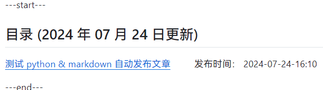
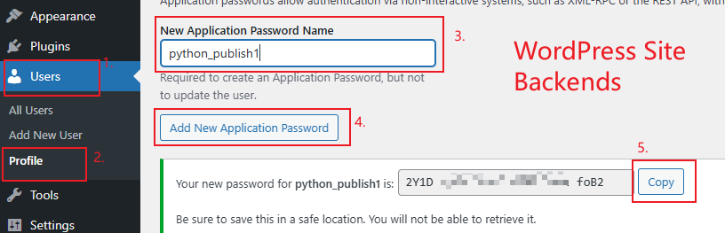

# Rublog - блог, Github - хранилище

Данный проект основан на [WordPressXMLRPCTools](https://github.com/zhaoolee/WordPressXMLRPCTools), что дало мне ключевое замысел.

Поскольку я не люблю xmlrpc, я использую RestAPI WordPress для обновления.

Библиотека WordPress API взята из [wordpress-markdown-blog-loader](https://github.com/binxio/wordpress-markdown-blog-loader) с незначительными изменениями.

[Нажмите здесь, пропустить содержание блога и перейти к описанию хранилища](#Написать статью в формате Markdown с использованием Github Actions и автоматически обновить ее на WordPress)

[Нажмите здесь, Инструкция по использованию склада](#Руководство по применению)

[中文简体](../README.md) --- [English](README_EN.md) --- [Deutsch](README_DE.md) --- [Français](README_FR.md) --- [Español](README_ES.md) --- [Русский](README_RU.md) --- [繁體中文](README_ZH-CHT.md) --- [日本語](README_JP.md)

---start---

## Содержание (обновлено 27 июля 2024 года)

[Как использовать GitHub Actions для публикации статей Markdown на сайт WordPress](https://www.rxx0.com/?p=4150) &emsp;&emsp;Дата публикации: 27 июля 2024 - 05:24

[Техники отладки GitHub Actions с использованием act](https://www.rxx0.com/software/diao-shi-github-actions-de-4-chong-gong-ju.html)  
Дата публикации: 27 июля 2024 года, 04:55

[Два способа решения проблемы Permission denied (publickey) при подключении к GitHub через SSH в SourceTree](https://www.rxx0.com/software/liang-chong-fang-fa-jie-jue-sourcetree-tong-guo-ssh-lian-jie-github-permission-denied-publickey-wen-ti.html)
&emsp;&emsp;Дата публикации: 26 июля 2024 года - 10:58

[Тестирование автоматической публикации статей на Python и Markdown](https://www.rxx0.com/software/test-python-and-markdown-to-automatically-publish-articles.html) &emsp;&emsp; Время публикации: 24 июля 2024 года - 16:10

---End---  

## Написать статью в формате Markdown с использованием Github Actions и автоматически обновить ее на WordPress

- Самый комфортный формат для записи блогов - это Markdown;

- Самый беспроблемный способ управления блоговым сайтом - это WordPress;

- Лучшая платформа для продвижения блогового сайта - это Github.

Этот проект позволяет вам писать блоги с использованием Markdown. После отправки (push) обновлений на Github, Github Actions автоматически обновляет статьи на WordPress и обновляет ссылки на статьи в README.md.


### Какие преимущества есть в использовании Github Actions?

Github Actions позволяет нам выполнить код без установки среды разработки.


Просто нужно создать новую статью в формате Markdown и обновить ее в репозитории. Github Actions автоматически обновит статью на WordPress и обновит ссылку на статью в README.md.



## Руководство по применению

### Плагины, которые необходимо установить для WordPress

- [Rankmath](https://rankmath.com/wordpress/plugin/seo-suite) Плагин SEO

### Получить необходимые настройки WordPress

Особой обработке подлежит только пароль для входа в WordPress. Этот пароль для входа не является паролем для административной панели веб-сайта. Необходимо отдельно сгенерировать пароль приложения RestAPI.

_Пароли приложений позволяют аутентифицироваться в неинтерактивных системах (например, XML-RPC или REST API) без ввода вашего фактического пароля. Пароли приложений можно отозвать в любое время. Они не могут использоваться для входа на ваш сайт традиционным способом._

Способ генерации следующий:




### Как защитить пароль от своего аккаунта WordPress?

На Github есть функция "секреты", которая позволяет защитить важные сведения, такие как имена пользователей и пароли. Только Github Actions могут получать доступ к таким важным сведениям.

Для данного проекта необходимо создать три секрета.

- Заполните имя пользователя для входа в WordPress, имя переменной — USERNAME
- Заполните пароль приложения WordPress RestAPI. Имя переменной: PASSWORD
- Заполните доменное имя WordPress. Имя переменной: HOST


### Разрешить Github Actions записывать обратно в хранилище

Функции безопасности Github становятся все более совершенными, и для этого требуется отдельно открыть это разрешение. Способы открытия следующие:


### Как создать новую статью?

Переименуйте папку example в каталоге `posted`, скопируйте ее в папку `need_post` и продолжайте редактировать файл `index.md` в формате markdown внутри папки.

В папке "images" хранятся ссылки на изображения, или можно напрямую ссылаться на изображения из сети, CDN-изображения или изображения с сервисов для размещения изображений.  


### Управление статьями: как классифицировать статьи и добавлять ключевые слова-теги?

Вставьте следующую инициализационную информацию в начало файла `.md`, чтобы настроить заголовок (title), теги (tags) и категории (categories). **Все следующие элементы являются обязательными для заполнения**.

```tag and category
author: xinyu2ru
categories:
- software
date: 2024-07-24 08:21:00
excerpt: Здесь пишется содержание резюме статьи. Этот текст должен появиться в резюме статьи.
image: images/banner.jpg
status: publish
title: Здесь пишется заголовок статьи
focus-keywords: markdown upload wordpress
```

- **author обязательно должен существовать**
- Каталоги категорий для "categories" обязательны для существования.
- Изображение баннера обязательно должно быть присутствует.

## Какая разница между тегами (tags) и категориями (categories)?

Тэги (tags) представляют собой ключевые слова для отдельной статьи. Например, тэгами для банана могут быть **желтый цвет**, **сладкий вкус** (тэги представляют свойства банана).
Категории являются принадлежностью данного статьи. Например, категория банана - **фрукт**, **растение**

## Как использовать?

После завершения вышеуказанной настройки

Каждый раз после добавления или обновления статей в папку `need_post`, просто запустите команды git!

```git
git pull && git add _posts && git commit -m "update" && git push
```

Также можно использовать различные программы для управления Git для отправки обновлений на GitHub.

### Отображение эффекта README.md на Github, (новые статьи располагаются в首位)


## Как выполнить операции по обновлению блога с помощью мобильного телефона?

Челоч - заметки. Позволяет писать на Markdown с элегантностью и комфортом.  

Obsidian, это также редактор программного обеспечения, который я в основном использую сейчас. Его можно использовать как на компьютере, так и на мобильном телефоне.

## Обновить

- Плагин SEO был изменен с Yoast на Rank Math (11 февраля 2025 года, 11:51)
- Обновить этот файл README (01.03.2025 09:32)
