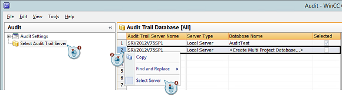
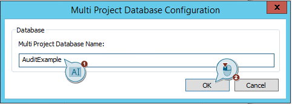
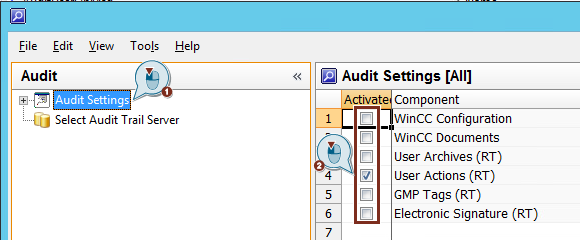
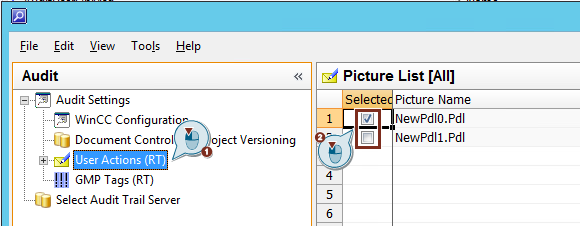
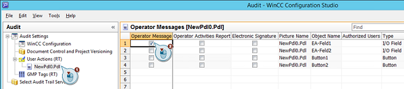

# 怎样设置 WinCC Audit？怎样选择 Audit 服务器并创建 Audit 数据库？

**问题描述**  
当设置 Audit 数据库时，选择 Audit 数据库的复选框不能选择（显示灰色）。不能选中或创建数据库。

**解决**  
下面的条件必须满足 FAQ 中描述的配置步骤：

* "SIMATIC Logon" 已经安装在计算机上。
* Windows 用户必须率属于用户组 "SIMATIC HMI AUDIT"。
* WinCC Audit 已安装并且 WinCC Audit RC 授权已通过 Automation License Manager 导入。

更多有关 WinCC Audit 授权应用的信息可看考下面链接： [Audit Licenses](https://support.industry.siemens.com/cs/ww/en/view/109749101/125994469131)

从WinCC Audit editor 打开 "Audit"。成功通过 SIMATIC Logon验证后打开编辑器窗口， 必须进行如下操作。

选择 Audit 服务器和 Audit 数据库：

1. 单击 "Select Audit Trail Server"
2. 在数据库名 <Create Multi Project Database…>行点击右键。如果选择一个存在的数据库，需要选择已存在的数据库名点击右键。
3. 点击 "Select Server" 创建一个数据库。

  
Fig. 1

给数据库分配一个名称：  

1. 为数据库分配一个名称。
2. 确定输入后点击 "OK"。

  
Fig. 2

继续按下面操作选择激活 Audit 的哪部分：

1. 点击 "Audit Settings".
2. 通过各自的复选框使能需要使能的组件。

**注**  
如果已经创建选中了数据库只需勾选复选框即可使能。

  
Fig. 3

最终，通过使能不同的组件来实现不同的 Audit 设置：

1. 点击需要的组件。
2. 选择项目组件的一部分来追踪设置。

  
Fig. 4

在 user actions 下指定一个画面， 必须使能所选画面单个对象的操作员输入消息：

1. 选择需要的画面。

2. 选择画面中需要用户操作的单个对象。

  
Fig. 5
