[Rublog](https://rxx0.com/) 现在想改成通过 GitHub 更新博客，写了一个模板 [Wordpress-RestAPI-PublishTools](https://github.com/xinyu3ru/Wordpress-RestAPI-PublishTools) repo，目前已经实现了脚本更新，剩下调试 GitHub actions。

Rublog 有两台办公电脑，一台家用电脑，而且喜欢重装系统。

在家用电脑上，sourcetree 软件通过 ssh 同步代码，id_ed25519 Key 没问题。
<!--more-->

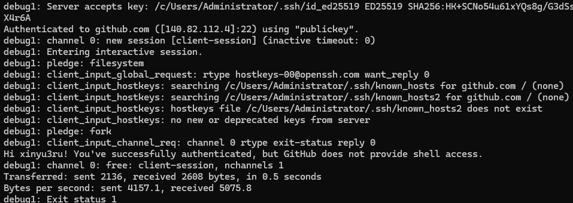

但是办公电脑上就有问题了，id_ed25519 key 是从家用电脑上复制过来的。


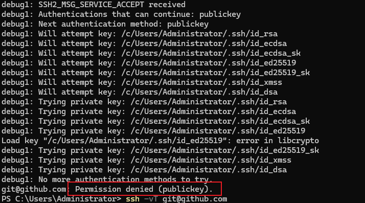

验证失败，拒绝访问。

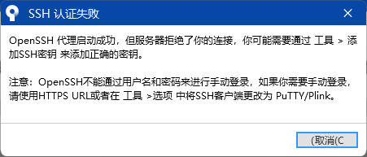

OpenSSH代理启动成功，但服务器拒绝了你的连接，你可能需要通过工具>添加SSH密钥来添加正确的密钥。
注意：OpenSSH不能通过用户名和密码来进行手动登录，如果你需要手动登录请使用HTTPSURL或者在工具>选项中将SSH客户端更改为PuTTY/Plink。

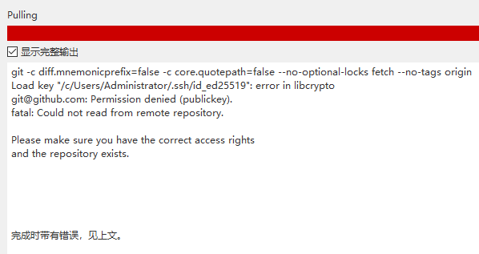

```git code
git -c diff.mnemonicprefix=false -c core.quotepath=false --no-optional-locks fetch --no-tags origin
Load key "/c/Users/Administrator/.ssh/id_ed25519": error in libcrypto
git@github.com: Permission denied (publickey).
fatal: Could not read from remote repository.

Please make sure you have the correct access rights
and the repository exists.
```

经过十多个小时的研究，发现是 openssh 高版本的 bug ，Windows 版本的 openssh 软件（例如 OpenSSH_9.7p1, OpenSSL 3.2.1 30 Jan 2024）无法处理 windows 换行符（CR LF）和 linux 换行符（LF）的兼容问题。

**解决方法有两种：**

1. 把 id_ed25519 的 windows 换行符（CR LF）更新为 linux 换行符（LF）
2. 替换 OpenSSH 版本

### 1.更新换行符

使用高级文本编辑器（例如 Notepad--）打开 id_ed25519 的 key 文件，让编辑器显示换行符，把换行符转换为 Linux 换行符（LF），保存。

另：id_ed25519 文件最后需要一行空行。

操作如下图：

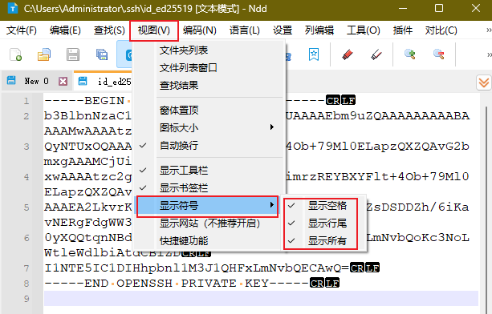

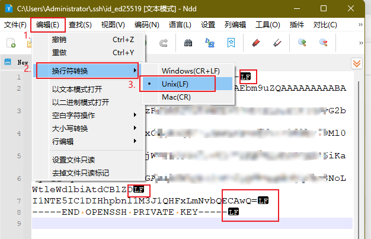

修改 id_ed25519 key 文件之后，再次测试连接 GitHub 服务器，成功连接，结果如下图：

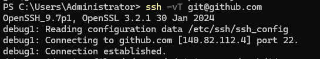

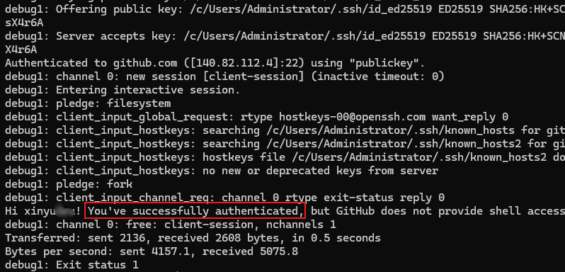

同时，sourcetree 也成功连接。

### 2.替换 OpenSSH 版本

部分 windows 11 默认安装了 OpenSSH，用低版本的软件替换即可。

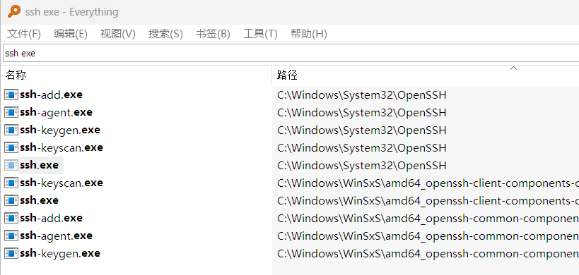

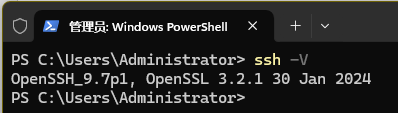

打开对应的文件夹，把低版本的软件替换进去即可

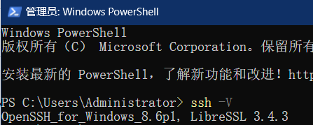

再次测试连接 GitHub 服务器，成功连接，同时 sourcetree 也成功连接。

## 提供下载服务

低版本的 ssh.exe OpenSSH（8.6）下载链接提供如下：
