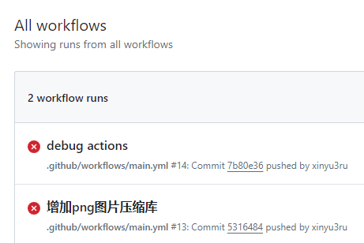

github actions 是一个很好的工具，但是刚开始使用的时候却很不好调试，这里记录搜索引擎能搜索到的 4 种工具。
<!--more-->
目前网上的调试方式有这几种方法:

1. 直接 push 到github，等 github 运行结束
2. 使用 nektos/act 调试
3. 使用 debug-action 调试
4. 使用 debugger-action 调试

### 直接 push 到github，等 github 运行结束

没有特殊情况，在 .github/workflows 下面编写好 xxx.yml, 直接 push 到 github，直接运行即可。

缺点如下：

- 速度慢
- 会弄乱 github 更新记录
- 生成很多无用 push

直接 push 调试 github actions 后果如下：



更多参数可以参考该链接[Enabling debug logging](https://docs.github.com/en/actions/monitoring-and-troubleshooting-workflows/troubleshooting-workflows/enabling-debug-logging)。

### 使用 nektos/act 调试

[nektos/act](https://github.com/nektos/act) 是一个可以在本地运行 GitHub Actions 的工具。

该工具优点如下：

- 快速反馈：无需每次都提交/推送更改到 .github/workflows/ 文件（或嵌入式 GitHub actions），使用 act 可以在本地运行 actions，环境变量和文件系统配置与 GitHub 提供的一致。
- 本地任务执行器：可以使用 act 中定义的 GitHub Actions 替代 Makefile，避免重复操作。
- 使用 Docker API 拉取或构建必要的镜像，并根据依赖关系确定执行路径，在容器中运行每个 action。

后会写一篇使用该工具调试 github actions 的技巧。

### 使用 debug-action 调试

[使用 debug-action 调试](https://github.com/marketplace/actions/debug-action) 让 github actions 运行输出更多参数，方便查看存在问题。

缺点和直接 push 调试 actions 差不多。输出样式如下：

```使用 debug-action 调试输出示例
▶ Environment variables
  ACTIONS_RUNTIME_TOKEN=***
  CI=true
  GITHUB_ACTION=hmarrdebug-action
  GITHUB_ACTIONS=true
  GITHUB_ACTION_REF=v2.0.0
  GITHUB_ACTION_REPOSITORY=hmarr/debug-action
  GITHUB_ACTOR=hmarr
  GITHUB_API_URL=https://api.github.com
  GITHUB_BASE_REF=main
  GITHUB_EVENT_NAME=pull_request_target
  GITHUB_EVENT_PATH=/home/runner/work/_temp/_github_workflow/event.json
  GITHUB_HEAD_REF=patch-1
  GITHUB_JOB=build
  GITHUB_REF=refs/heads/main
  GITHUB_REPOSITORY=hmarr/demo
  GITHUB_REPOSITORY_OWNER=hmarr
  GITHUB_RUN_ID=658297586
  GITHUB_RUN_NUMBER=15
  GITHUB_SERVER_URL=https://github.com
  GITHUB_SHA=a4171998f9bf51fc5b9d0283b7d5243ac28954d1
  GITHUB_WORKFLOW=approve
  GITHUB_WORKSPACE=/home/runner/work/demo/demo
  HOME=/home/runner
  INPUT_GITHUB-TOKEN=***
  INVOCATION_ID=44ad8f42f5244809971260b35b889a08
  LEIN_HOME=/usr/local/lib/lein
  LEIN_JAR=/usr/local/lib/lein/self-installs/leiningen-2.9.5-standalone.jar
  PATH=/usr/local/sbin:/usr/local/bin:/usr/sbin:/usr/bin:/sbin:/bin
  RUNNER_OS=Linux
  RUNNER_TOOL_CACHE=/opt/hostedtoolcache
  RUNNER_USER=runner
  RUNNER_WORKSPACE=/home/runner/work/demo
  USER=runner

▶ Event JSON
  {
    "action": "opened",
    "number": 20,
    "pull_request": {
      ...
    }
  }
```

我们的工具网站转换完成之后，还提供转换完成文件的下载服务，当然你也可以扫码下载。这是一个简单的下载链接的示例[随便一个图片](./images/bt_panel_2024-06-06_10-24-22.png) ，其实和插入图片或者超链接是差不多的。

### 使用 debugger-action 调试

[Debugger Action](https://github.com/marketplace/actions/a-debugger-for-actions) 是国人写的一个调试 GitHub Actions 的 GitHub Action 。

该工具优点如下：

- 有中文博客说明文档。
- 可以进入 actions runner，执行命令。

该工具的中文说明文档在这里[GitHub Actions 在线调试工具：debugger-action](https://www.chenshaowen.com/blog/a-debugger-for-actions.html)。

## 最后总结

以上是网络搜索到的 4 种调试方式，刚开始写 github actions 是比较困难的，特别是没有可以直接用的 actions 的情况下。

预祝您调试顺利，开心写代码~
