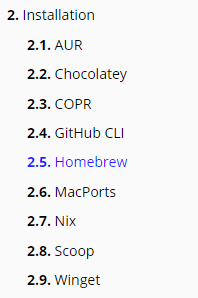
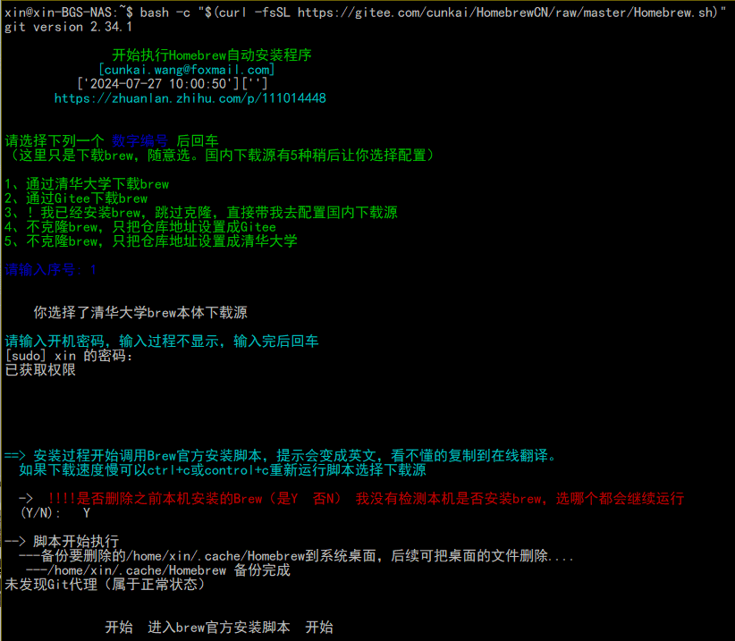
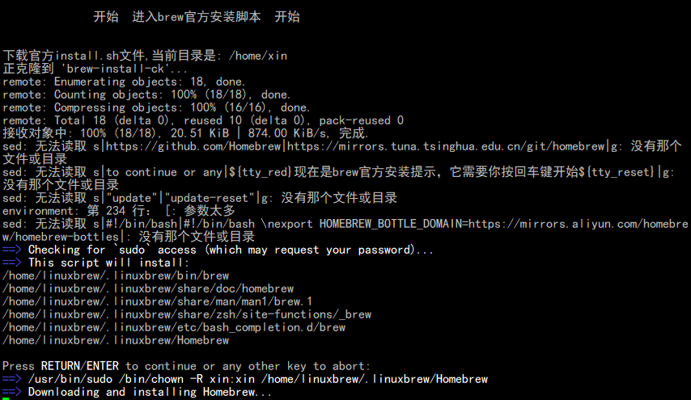
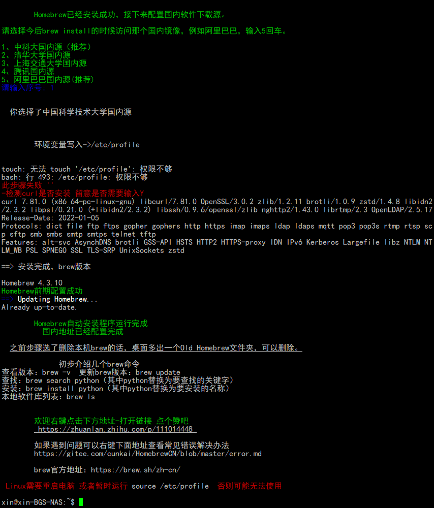
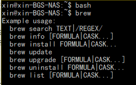
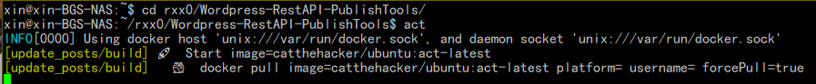

github actions 是一个很好的工具，但是刚开始使用的时候却很不好调试，这里记录使用 act 调试 github actions 的技巧。
<!--more-->

[nektos/act](https://github.com/nektos/act) 是一个可以在本地运行 GitHub Actions 的工具。他们的官网是 [act-"Think globally, act locally"](https://nektosact.com/) 。

### 安装

nektos/act 提供了 9 种安装方法，实际上是分平台的。Windows 平台可以选 Chocolatey、Github CLI、Scoop、Winget ，Linux 推荐 Github CLI、Homebrew 。



rublog 日常使用的是 Windows，但是 win 系统下没有安装 docker 。所以没有测试 Windows 使用 nektos/act 。

rublog 有台 NAS，使用 Ubuntu 系统，并且安装了 Docker。所以rublog 使用 Linux 下的 nektos/act。

遇到第一个问题就是 Github CLI 访问 github 故障，不折腾了，不用这个工具。

遇到第二个问题是 Homebrew 安装不顺畅，毕竟它从 github 拉取代码。

[Homebrew 中文官网](https://brew.sh/zh-cn/)，有中文官网和中文说明。

但是 rublog 推荐这篇教程[Homebrew快速安装、国内加速、问题修复、常用命令、注意事项](https://www.didispace.com/installation-guide/base-tools/homebrew.html)。





安装的时候，需要把代码种的 `/bin/zsh` 替换为 `sh` 或者 `bash` 。

```安装homebrew脚本
bash -c "$(curl -fsSL https://gitee.com/cunkai/HomebrewCN/raw/master/Homebrew.sh)"
```

使用过程种，每次断开 ssh 连接，Homebrew 都无法再次启动。经过测试，每次新连接 ssh 之后，先运行 `bash` 命令或者 `sh` 命令，再执行 `brew` 命令可正常运行。



### 使用 nektos/act 技巧

进入到代码文件夹，直接执行 `act` 即可。



Docker Hub 被某些垃圾恶意使用，导致了该服务被屏蔽，所以直接执行 `act` 会一直卡 docker pull 。

有两种方式：一种是挂 docker 代理，一种是换源。也可以直接把 docker 提前拉取下来。

```拉取github actions runner镜像
docker pull ghcr.io/catthehacker/ubuntu:act-22.04
```

[更多 docker images 在这个页面](https://github.com/catthehacker/docker_images)

act 常用的调试方法如下：

```act 常用的调试方法
act
```

```act 常用的调试方法
act -j build
act -j yml文件种jobs下的任务名
```

给 act 挂代理的方法之一：

```给 act 挂代理的方法之一
act -j build --env https_proxy=http://代理账号:代理密码@代理IP或者网址:代理端口 --env http_proxy=代理账号:代理密码@代理IP或者网址:代理端口
```

虽然挂了代理，但是调试还是不算顺畅，如果有海外 VPS 可以用海外 VPS 调试，应该能更顺畅。

## 最后总结

以上就是我调试过程中遇到的问题。

预祝您调试顺利，开心写代码~